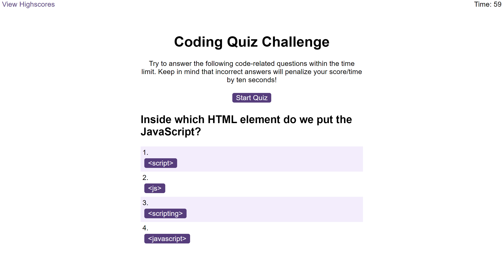

# JavaScript_Quiz
This is an interactive quiz for assessing your JavaScript Knowledge.

## Description

The purpose of this project is to create an ineteractive quiz for users to assess their javascript knowledge.

This quiz is powered by javascript.

## Table of Contents 

- [Installation](#installation)
- [Features](#features)
- [Credits](#credits)
- [License](#license)

## Installation

Click this link for accessing the Quiz:
https://sumzulfikar.github.io/JavaScript_Quiz/

A screenshot of the application:

Right click and click inspect

## Features

1. A start button that when clicked a timer starts and the first question appears.
2. Questions contain buttons for each answer.
3. When answer is clicked, the next question appears
4. If the answer clicked is incorrect then time is subracted from the clock
5. The quiz ends when all questions are answered or the timer reaches 0.
6. When the game ends, the application display the score and give the user the ability to save their initials and their score 

## Credits

- This has been a though challenge and Bootcamp Xpert and googling various articles on DOM javascript has been very helpful. 

## License

MIT License

## Badges

## Tests

Acceptance Criteria met.
